# Die native App — Ansicht für Ansicht

Die **native GTK-4-/libadwaita-Oberfläche** (`app/src/frontends/desktop`) ist eine von vier
Oberflächen über demselben Kern — neben CLI, `steuer web` und dem MCP-Server. Sie rendert mit
echten Adwaita-Widgets und importiert die Aktionen **im selben Prozess (kein HTTP)**. Dieser
Rundgang zeigt jeden Bildschirm und erklärt, wofür er da ist.

- **App-Id:** `eu.jumplink.Steuererklaerung` · **Untertitel:** „Native Vorschau" — sie ist eine.
- **Stand heute:** **lesen und prüfen zuerst.** Jede Ansicht zeigt und prüft; geschrieben wird nur
  an wenigen Stellen (Einstellungen, Beleg-Eingang, Anlageverzeichnis). Die Abgabe läuft über die CLI.
- Quellen und Architektur: [`app/src/frontends/desktop/README.md`](../../app/src/frontends/desktop/README.md).

> **Alle Bilder stammen aus der Demo-Entität.** Erfundene Firma (*Fischer & Weber GbR*),
> erfundene Zahlen, erfundene Kunden — nachzulesen in
> [`app/demo/`](../../app/demo/). Nachstellen lässt sich jede Aufnahme mit `STEUER_DEMO=1`;
> wie genau, steht [unten](#die-bilder-neu-erzeugen). Aufnahmen aus dem eigenen, echten
> Datenbestand gehören nicht ins Repository — `docs/app/screenshots/` ist genau deshalb
> gitignoriert.

## Der Rahmen — auf jedem Bildschirm gleich

- **Sidebar (links):** oben die Identität — **Entitäts-Karte** (Firma bzw. `Privat`) und
  **Jahres-Segmente** —, darunter die zwölf Navigationseinträge mit Titel, Untertitel und
  Adwaita-Symbol. Ein Wechsel von Entität oder Jahr lädt die aktive Ansicht neu.
- **Kopfzeile:** Titel und Untertitel der Ansicht, rechts der **Abgleich-Knopf** (Pfeile) und der
  Stern für den KI-Assistenten. Siehe „Abgleich im Hintergrund“ unten.
- **Assistent (rechts):** ein andockbares Panel, ab 1180 px Fensterbreite neben dem Inhalt,
  darunter als Overlay.

**Die Sidebar richtet sich nach der Entität.** Rein betriebliche Ansichten (Beleg-Eingang,
Rechnungen, Kontakte, Projekte, Auswertungen) verschwinden bei einer `privat`-Entität; **Steuer**
erscheint nur, wenn eine ELSTER- oder ESt-Konfiguration vorliegt. Deshalb zeigen die
GbR-Aufnahmen das volle Menü.

**Ladeverhalten.** Store-Ansichten erscheinen sofort — es ist ein lokaler, indizierter,
synchroner SQLite-Zugriff. Ansichten, die auf dem EÜR-Aggregat oder einem entfernten DMS
aufsetzen, zeigen erst einen Spinner („Berechne EÜR …"), damit die angezeigten Zahlen immer
das fertige Ergebnis sind und nie ein Zwischenstand.

---

## 1. Übersicht — Zahlen und was als Nächstes ansteht

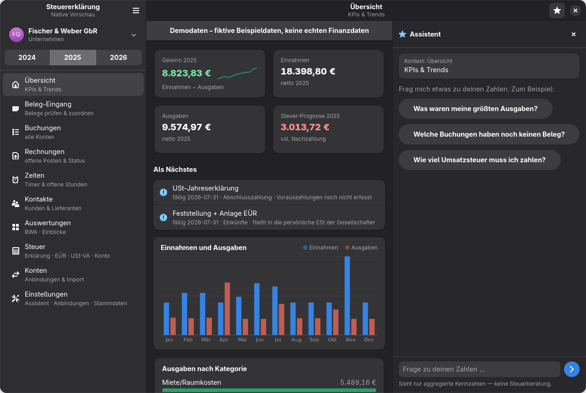

Der Einstieg: Gewinn, Einnahmen, Ausgaben und die Steuer-Prognose des Jahres als Kacheln,
darunter **Als Nächstes** (die nächsten Fristen mit Fälligkeit und Begründung), der Verlauf von
Einnahmen und Ausgaben über die Monate, die Ausgaben nach Kategorie und die Liquidität.

Rechts im Bild das **Assistenten-Panel**. Es beantwortet Fragen in natürlicher Sprache zum
gewählten Entität-Jahr („Wie hoch war mein Gewinn?", „Welche Buchungen haben noch keinen
Beleg?"). Das Modell bekommt dabei **nur aggregierte Kennzahlen** — keine IBANs, keine
Steuernummern, keine Dokumentinhalte —, und das Panel sagt es unten selbst dazu. Es ist eine
bequeme Linse auf dieselben Daten, keine Steuerberatung.

## 2. Beleg-Eingang — Belege prüfen und zuordnen

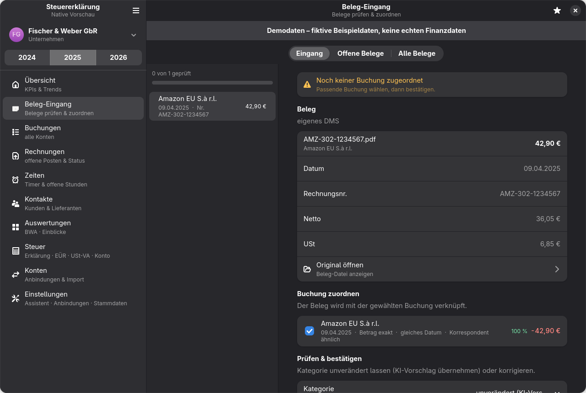

Der erste von drei Reitern unter **Beleg-Eingang**, und die Arbeitsfläche für neue Belege: links
die Warteschlange, rechts der Beleg mit den extrahierten Feldern (Datum, Rechnungsnummer, netto,
USt), einem **Vorschlag für die passende Buchung** samt Trefferbegründung („Betrag exakt ·
gleiches Datum · Korrespondent ähnlich") und der Kategorie. Bestätigen übernimmt den
KI-Vorschlag, korrigieren überschreibt ihn — beides schreibt die Begründung an den Beleg zurück.

## 3. Offene Belege — die Vorsteuer-Lücke

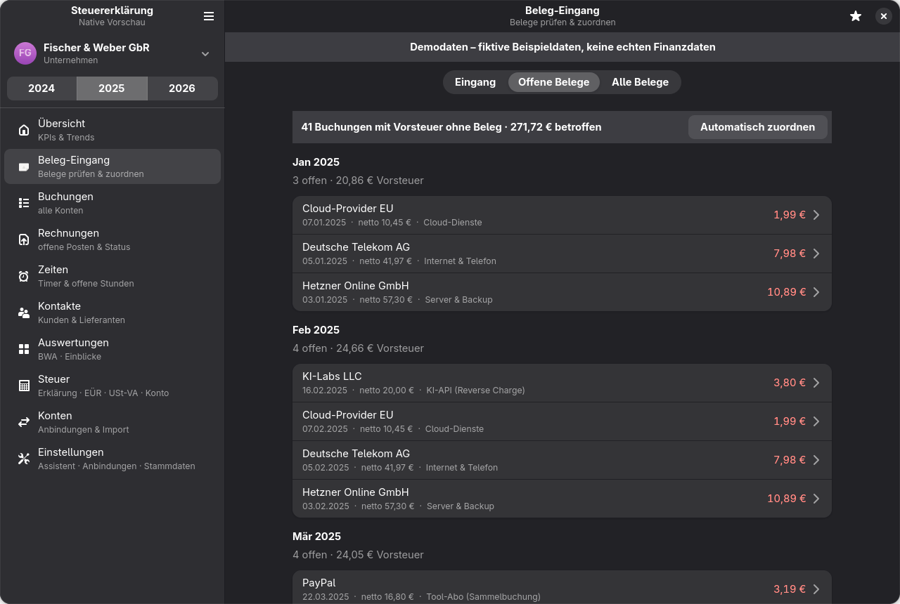

Der prüfungsrelevante Rest: Ausgaben, die **Vorsteuer ziehen, aber keinen Beleg haben**. Die
Ansicht kreuzt die klassifizierten Zeilen des EÜR-Aggregats gegen die verknüpften Buchungen des
DMS und gruppiert die Treffer **nach Monat**, mit der betroffenen Vorsteuer je Monat und gesamt.
Das ist die Arbeitsliste zum Jahresabschluss: jede Zeile ist eine Rechnung, die noch fehlt, bevor
sich ihre Vorsteuer gefahrlos abziehen lässt.

## 4. Alle Belege — der Dokumentenbestand

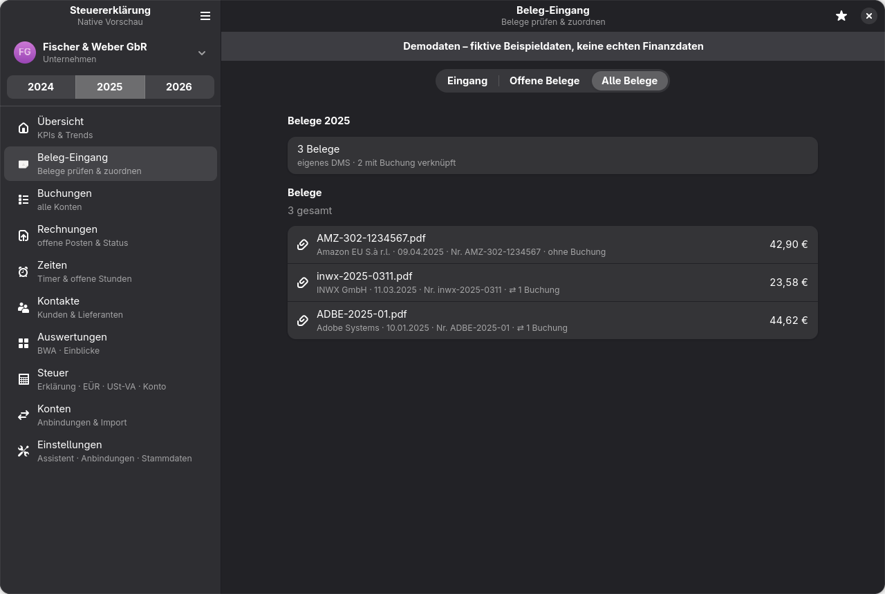

Der dritte Reiter listet alle Belege des Entität-Jahres über denselben `DmsProvider`, den auch
die Web-Oberfläche benutzt: beim eingebauten DMS ein lokaler SQLite-Zugriff, bei einer
Paperless-Entität ein HTTP-Abruf. Kopfkarte mit Anzahl und Verknüpfungsquote, je Zeile
Korrespondent, Datum, Belegnummer, Betrag und die Buchungsverknüpfung.

## 5. Buchungen — das Journal

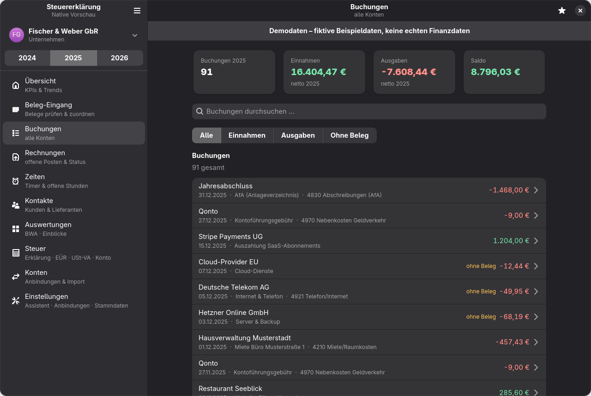

Alle Buchungen des Entität-Jahres über sämtliche Konten: oben eine Übersichtskarte (Anzahl,
Einnahmen, Ausgaben, Saldo), darunter Suche, Filter (Alle · Einnahmen · Ausgaben · **Ohne
Beleg**) und die einzelnen Buchungen, neueste zuerst. Jede Zeile zeigt Gegenpartei, Datum,
Kategorie und SKR-Konto; fehlende Belege sind markiert. Gelesen wird aus dem lokalen Store —
kein ausgehender Aufruf, die Ansicht ist sofort da.

## 6. Rechnungen — Ausgangsrechnungen und Wiederkehrendes

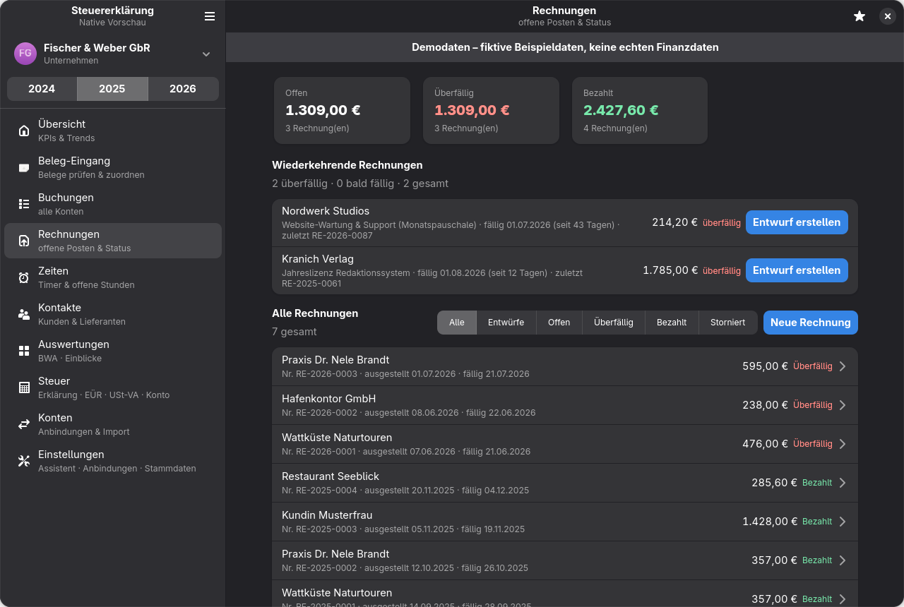

Oben Offen / Überfällig / Bezahlt als Summen, dann zwei Abschnitte: **Wiederkehrende Rechnungen**
(Verträge mit Intervall, Fälligkeit und „Entwurf erstellen") und **Alle Rechnungen** mit
Statusfiltern. Je Zeile Kunde, Rechnungsnummer, Ausstellungs- und Fälligkeitsdatum, Betrag und
farbcodierter Status. Das Rechnungs-Backend ist pro Entität wählbar: Qonto oder das eigene
(Entwurf → Festschreiben → PDF → XRechnung → Storno).

**Jahr und Summen:** Die Liste zeigt bezahlte und stornierte Rechnungen des gewählten Jahres (nach
Ausstellungsdatum) und dazu alle noch unbezahlten — Entwurf, offen, überfällig — aus jedem Jahr, denn eine
Forderung endet nicht zum 1. Januar. Offen und Überfällig zählen deshalb jahresübergreifend, Bezahlt nur das
gewählte Jahr.

**Qonto nur mit Qonto-Konto:** Die Qonto-Zugangsdaten gelten für die ganze Installation. Eine Entität nutzt
Qonto für Rechnungen nur, wenn ihre Konten ein `qonto:`-Konto enthalten. Ohne dieses zeigt der Rechnungen-Tab
eine Hinweisseite („Kein Qonto-Konto") statt der Rechnungen einer anderen Entität; CLI und MCP melden
denselben Grund als Fehler und legen nichts an. Lösung: unter Einstellungen → Anbindungen ein Qonto-Konto
zuordnen oder das Rechnungs-Backend auf „Selbst" stellen. Ist nichts eingestellt, wählt die App das Backend
selbst: Qonto mit Qonto-Konto, sonst das eigene.

**Per E-Mail senden:** Im Detail jeder abgeschlossenen Rechnung (Qonto wie eigenes Backend) schickt die App
die Rechnung über den SMTP-Zugang der Entität, mit dem PDF im Anhang, nach Vorschau und Bestätigung. Das
Versandkonto richtest du einmal unter Einstellungen → Anbindungen → E-Mail-Versand ein (Server, Port,
Verschlüsselung, Benutzer, Passwort, Absenderadresse). „Verbindung testen" meldet sich nur am Server an und
verschickt nichts; das Passwort liegt im Schlüsselbund, nie in der Konfiguration. Der Versanddialog zeigt nur
noch „Von: <Absender> (SMTP)"; ohne Konto verweist er mit „Versandkonto einrichten" in die Einstellungen. Bei
Qonto
lädt sie das PDF dafür über die Datei der Rechnung herunter; hat Qonto es nach dem Abschließen noch nicht
erzeugt (das dauert einige Sekunden), nennt die App das und sendet nichts. Ein Entwurf hat kein PDF.

**Zahlungslink in der Mail:** Bei Qonto-Rechnungen steht in der Mail die Zeile „Online ansehen und bezahlen:
<Link>", der öffentliche Link der Rechnung (`invoice_url`, `https://pay.qonto.com/invoices/…`). Im Text ist das
der Platzhalter `{zahlungslink}`. Hat die Rechnung keinen Link (eigenes Backend), entfällt die ganze Zeile.
Ohne Namen lautet die Sie-Anrede „Guten Tag,", die Du-Anrede „Hallo,".

**Verlauf pro Rechnung:** Jeder Versandversuch wird in der lokalen Datenbank (Tabelle `invoice_mails`)
vermerkt, auch ein Fehlschlag mit seiner Ursache: Zeitpunkt, Von, An, Betreff, Message-ID, Ergebnis. Kein
Text, kein Anhang, keine Zugangsdaten. Der Versanddialog zeigt „Achtung: schon gesendet am …" und listet die
bisherigen Versendungen. Ob Qonto selbst eine Rechnung per Mail verschickt hat, gibt die Qonto-API nicht her
(Rechnungsobjekt: [Doku](https://docs.qonto.com/api-reference/business-api/expense-management/client-quotes-notes/client-invoices/retrieve-a-client-invoice)),
deshalb zeigt die App nur, was sie selbst gesendet hat.

**Mailvorlagen:** Unter Einstellungen → Anbindungen → E-Mail-Vorlagen legst du benannte Vorlagen an
(z. B. „Hosting", „Dienstleistung"), je mit Betreff und Text für Du und optional für Sie (leer = Du-Text). Eine
Vorlage ist der Standard der Entität; ein Projekt und ein Vertrag können eine andere wählen (Reihenfolge:
Vertrag → Projekt → Standard der Entität → eingebauter Text). Im Versanddialog lässt sich die Vorlage
umschalten; Änderungen von Hand werden nur nach Rückfrage verworfen. Ohne Vorlagen bleibt alles wie bisher.
CLI: `steuer invoices recurring email <id> --template <id>`.

**Platzhalter** (auch im Betreff; im Editor per Klick einfügen):

| Platzhalter | Wert |
|---|---|
| `{anrede}` | Anredezeile nach Du/Sie |
| `{kunde}` | Kundenname |
| `{rechnungsnummer}` | Rechnungsnummer (alt: `{nummer}`) |
| `{betrag}` / `{netto}` | Brutto- / Nettobetrag |
| `{datum}` / `{faelligkeit}` | Rechnungs- / Fälligkeitsdatum |
| `{leistungszeitraum}` | Leistungszeitraum (alt: `{periode}`) |
| `{positionen}` | Titel der Positionen |
| `{domain}` / `{projekt}` | Domains bzw. Bezeichnung / Projektname |
| `{zahlungslink}` | Link zum Ansehen und Bezahlen |
| `{gruss}` / `{aussteller}` | Grußformel / Name des Ausstellers |

Fehlt ein optionaler Wert (`zahlungslink`, `leistungszeitraum`, `projekt`, `positionen`, `domain`, `datum`,
`netto`), entfällt die ganze Zeile; ohne Fälligkeit entfällt nur „fällig am …". Fehlt ein Pflichtwert
(`rechnungsnummer`, `betrag`, `kunde`, `anrede`, `aussteller`), bleibt die Stelle leer und die Vorschau meldet
„Fehlende Werte". Ein **unbekannter Platzhalter** (Tippfehler wie `{betrg}`) sperrt das Senden: der Dialog
deaktiviert „Vorschau und Senden", die CLI und der Kern verweigern den Versand.

**Mailvorschau auf der Kommandozeile:** `steuer invoices recurring email <id>` zeigt die Mail zur zuletzt
ausgestellten Rechnung des Vertrags (Nummer, Betrag, Fälligkeit, Zahlungslink) mit derselben Anrede wie der
Dialog: Projekt-Ansprechperson vor Vertrag. Nicht die Folgeperiode: die gibt es erst als Rechnung, wenn sie
erstellt ist. Gibt es noch keine Rechnung, sagt der Befehl das.

**Rechnungsnummer abgleichen:** „Entwurf erstellen" trägt die Nummer des Entwurfs ein (bei Qonto eine
`-PROFORMA`-Nummer). Die endgültige Nummer gibt es erst nach dem Festschreiben, und nach einem Storno
gilt die Ersatzrechnung. Beim Laden der Rechnungen zieht die App die letzte Rechnung jedes Vertrags
deshalb auf den Stand im Backend nach (Nummer, Datum, Link). Nach einem Storno folgt sie der neuen
Rechnung zum selben Kunden und Leistungszeitraum; der Versandvermerk der stornierten Rechnung entfällt,
weil diese Mail für die alte Rechnung ging. Zeitraum und nächste Fälligkeit bleiben unberührt. Ohne
Ersatzrechnung bleibt der Eintrag stehen. Von Hand:

```sh
steuer invoices recurring reconcile --entity firma --dry-run   # zeigt nur, was sich änderte
steuer invoices recurring reconcile --entity firma
```

**Anschreiben:** Jeder wiederkehrende Posten kann einen Text über den Positionen tragen
(„Wiederkehrend bearbeiten → Anschreiben"), samt Anrede, Anrede-Form (Du oder Sie; ohne Angabe Du) und Grußformel des Kunden und einer
Live-Vorschau. Die Vorlage kennt die Platzhalter `{anrede}`, `{kunde}`, `{domain}`, `{periode}`,
`{vorperiode}`, `{paket}`, `{gruss}` und `{aussteller}`; ein unbekannter Platzhalter wird beim
Speichern abgelehnt. Ohne eigenen Text gilt das Standard-Anschreiben der Entität für die jeweilige Form
(Einstellungen → Rechnungsstellung, getrennt für Du und Sie), ohne beides gibt es keins. Fehlt die
Anrede, entfällt `{anrede}` samt Leerzeichen („Hallo,“ statt „Hallo Firma,“) und die Vorschau
sowie `recurring create --dry-run` weisen darauf hin. Fehlt die Grußformel, steht „Beste Grüße“
(Du) bzw. „Mit freundlichen Grüßen“ (Sie). Das Anschreiben ist die Qonto-Kopfzeile bzw. der
Kopftext der eigenen Rechnung.

**Projekte:** Die Ansicht **Projekte** (Sidebar, unter Steuer) listet sie mit Kunde, Domains und der Zahl der
zugeordneten Posten; „Projekt hinzufügen“ und ein Klick auf eine Zeile öffnen das Formular (Name, Kunde per
Kontaktauswahl, Domains, Kontaktperson, Notiz). Löschen verweigert die App, solange ein Posten am Projekt hängt. In
„Wiederkehrend bearbeiten“ wählt man Kunden-Kontakt und Projekt; angeboten werden nur die Projekte dieses Kunden,
und die Vorschau nennt, wer angesprochen wird und woher die Anrede kommt. Ein Projekt bündelt einen Kunden (Kontakt), dessen Domains und optional die
Kontaktperson, die im Anschreiben angesprochen wird (Anrede, Vorname, Du oder Sie). Mehrere
wiederkehrende Posten können zum selben Projekt gehören (etwa Hosting und Domain einer Website),
ein Posten gehört zu höchstens einem Projekt. Projekte sind freiwillig: Ohne sie arbeiten Posten
und Zeiten unverändert weiter. Die Anrede im Anschreiben folgt dieser Kette, getrennt für Anrede
und Du/Sie: Kontaktperson des Projekts → `customer.greeting` bzw. `customer.formality` des Postens
→ leer mit dem Hinweis „Anrede fehlt“ (Du ist die Vorgabe). Der Kundenname springt nie ein.
Das Projekt eines Postens muss zum selben Kunden gehören; ein unbekanntes oder fremdes Projekt
wird beim Speichern und beim Anschreiben mit einer klaren Meldung abgelehnt.

```sh
steuer projects add --entity firma --name "Website Relaunch" --contact c_… \
    --domain beispiel.de --greeting "Silke" --formality sie
steuer projects list --entity firma            # Projekte samt zugehöriger Posten
steuer projects edit website-relaunch --entity firma --greeting "Frau Muster"
steuer projects edit website-relaunch --entity firma --formality inherit   # Du/Sie wieder wie im Vertrag
steuer invoices recurring set-project beispiel-hosting --entity firma --project website-relaunch
steuer projects suggest --entity firma         # schlägt Projekte aus Kunde + Domains vor
```

`projects suggest` schreibt nichts: Es gruppiert die Posten je Kunde nach gemeinsamen Domains und
druckt die Befehle zum Übernehmen. `projects remove` verweigert, solange ein Posten am Projekt
hängt; `--dry-run` prüft `add`, `edit`, `remove` und `set-project`, ohne zu schreiben.
`--formality inherit` entfernt die Anredeform des Projekts, sodass wieder die `customer.formality` des
Postens gilt; Anrede und Vorname bleiben, `--greeting ""` leert die Anrede entsprechend.

**Zeiten und Projekte:** `time start|add --project …` nimmt eine Projekt-Id oder einen Projektnamen.
Bei einem eindeutigen Treffer trägt der Eintrag die Projekt-Id und den Kunden des Projekts, sonst
bleibt es beim freien Namen wie bisher. Der Import des alten Trackers legt nie ein Projekt an; er
ordnet Namen nur zu und listet, was zu keinem Projekt und keinem Kunden passt.

In der Ansicht **Zeiten** wählt man das Projekt beim Starten des Timers aus einer Liste (alle Projekte der
Entität; „Kein Projekt“ lässt das freie Namensfeld stehen). Ein Projekt setzt Namen, Projekt-Id und Kunden
des Eintrags wie `time start --project`. In der Liste der erfassten Zeiten ordnet der Stift-Knopf einen
Eintrag einem Projekt zu oder löst ihn davon; angeboten werden die Projekte des Kunden des Eintrags, ohne
Kunde alle. Abgerechnete Einträge bleiben unverändert. Listen und die Summe „Noch nicht abgerechnet“
zeigen den aktuellen Projektnamen, bei Einträgen ohne Projekt das gespeicherte Label.

## 7. Kontakte — Kunden und Lieferanten

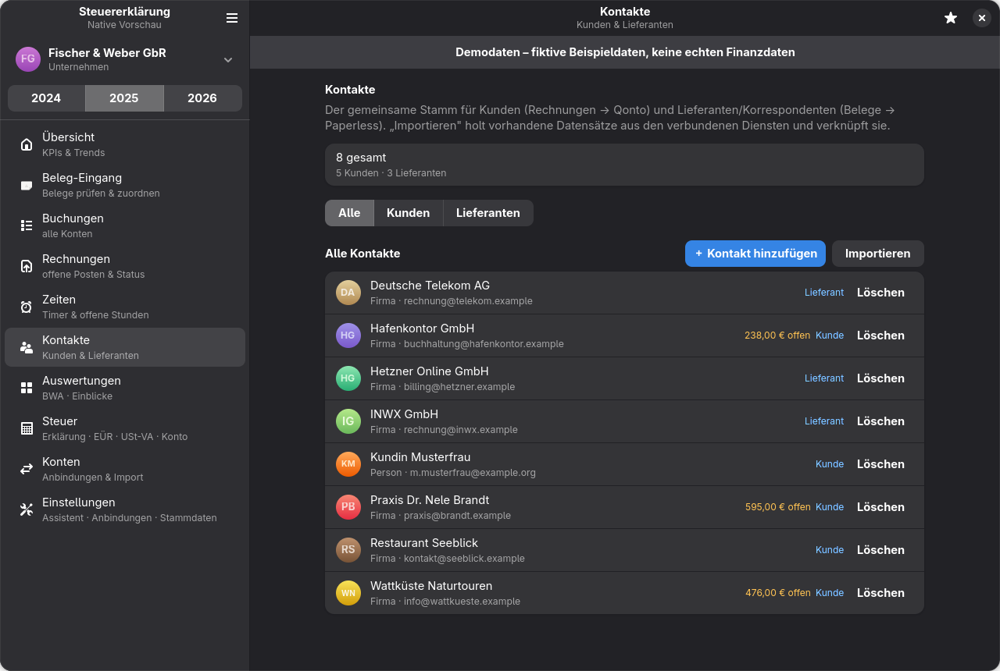

Der gemeinsame Stamm für Kunden (→ Rechnungen) und Lieferanten/Korrespondenten (→ Belege), auf
die Entität eingegrenzt. „Importieren" holt vorhandene Datensätze aus den verbundenen Diensten
und verknüpft sie, statt Dubletten anzulegen. Bei Kunden mit offenen Rechnungen steht der offene
Betrag in der Zeile.

## 8. Auswertungen — BWA und Einblicke

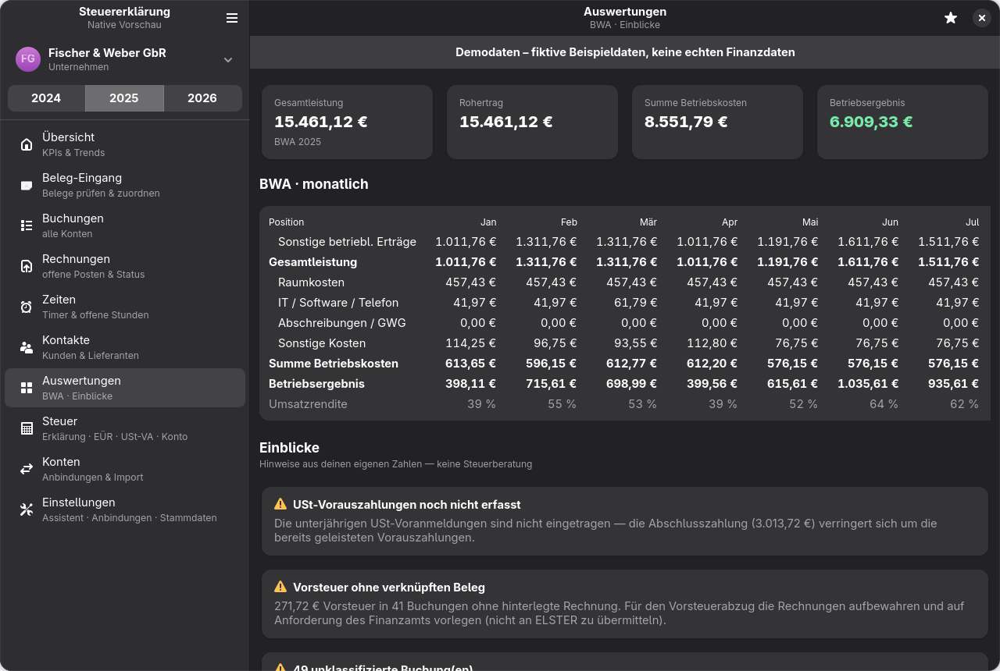

Oben die betriebswirtschaftliche Auswertung: Gesamtleistung, Rohertrag, Betriebskosten und
Betriebsergebnis als Summen über einer **Monatsmatrix** (Jan–Dez, Erträge, Kostengruppen,
Ergebnis, Renditen). Darunter **Einblicke** — Hinweise, die sich aus den eigenen Zahlen ergeben
(nicht erfasste USt-Vorauszahlungen, Vorsteuer ohne Beleg, unklassifizierte Buchungen,
Kleinunternehmer-Grenze) mit dem jeweiligen Betrag und der Rechtsgrundlage. Ausdrücklich als
„keine Steuerberatung" gekennzeichnet.

## 9. Steuer › Erklärung — der Weg zur Abgabe

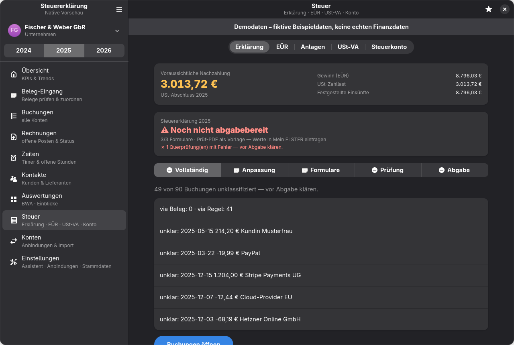

Der erste Reiter des Steuer-Hubs und die Antwort auf „kann ich abgeben?". Oben die
voraussichtliche Nachzahlung mit ihren Bestandteilen, darunter der Abgabestatus mit dem Grund,
warum er so ist. Die fünf Schritte darunter — **Vollständig · Anpassung · Formulare · Prüfung ·
Abgabe** — sind der Ablauf: sind alle Buchungen klassifiziert (und wie: über Beleg oder über
Regel), sind die nicht zahlungswirksamen Anpassungen erfasst (AfA, Privatanteil,
Betriebsaufgabe), stehen die Formulare mit ihren Kennzahlen und Exporten, und was ist vor der
Abgabe noch zu klären.

## 10. Steuer › EÜR — Anlage EÜR

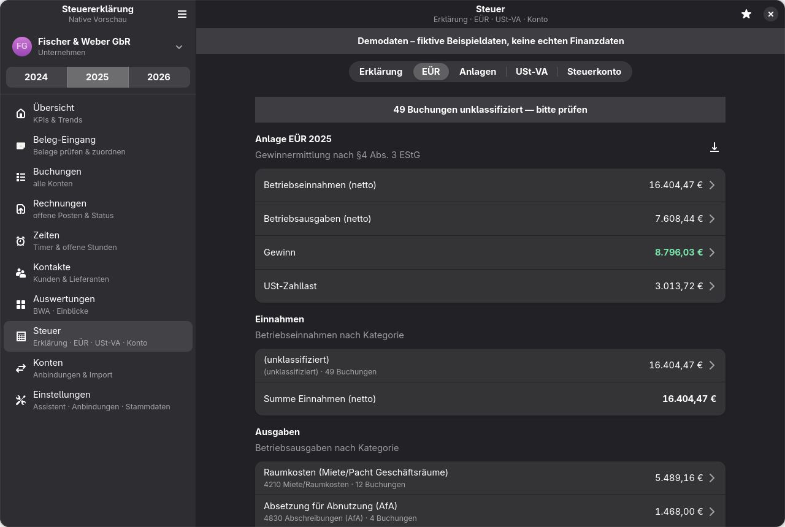

Die Gewinnermittlung nach § 4 Abs. 3 EStG: Betriebseinnahmen, Betriebsausgaben, Gewinn und
USt-Zahllast, darunter Einnahmen und Ausgaben nach Kategorie mit SKR-Konto und Buchungszahl.
Jede Zeile lässt sich bis auf die einzelnen Buchungen aufklappen — das ist der Kern der
Gegenprüfbarkeit. Das Download-Symbol exportiert das **Prüf-Datenblatt als PDF**. Alle
Steuer-Reiter rechnen aus **einem gemeinsamen, zwischengespeicherten EÜR-Aggregat**, sodass
Feststellung, GewSt und USt-Jahreserklärung garantiert dieselbe Grundlage haben.

## 11. Steuer › Anlagen — Anlageverzeichnis und AfA

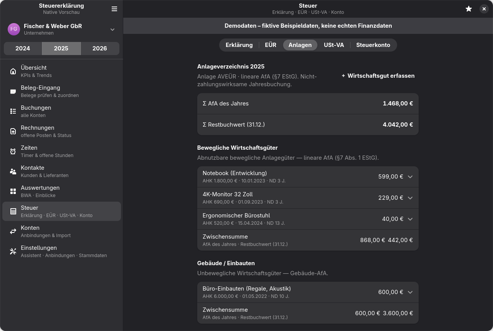

Die nicht zahlungswirksame Jahresbuchung: Anlage AVEÜR mit linearer AfA nach § 7 EStG, getrennt
nach beweglichen Wirtschaftsgütern und Gebäude/Einbauten. Je Position Anschaffungskosten, Datum,
Nutzungsdauer, AfA des Jahres und Restbuchwert zum 31.12.; die Jahres-AfA fließt direkt in die
EÜR. Ein Wirtschaftsgut lässt sich hier erfassen.

## 12. Steuer › Steuerkonto — was tatsächlich geflossen ist

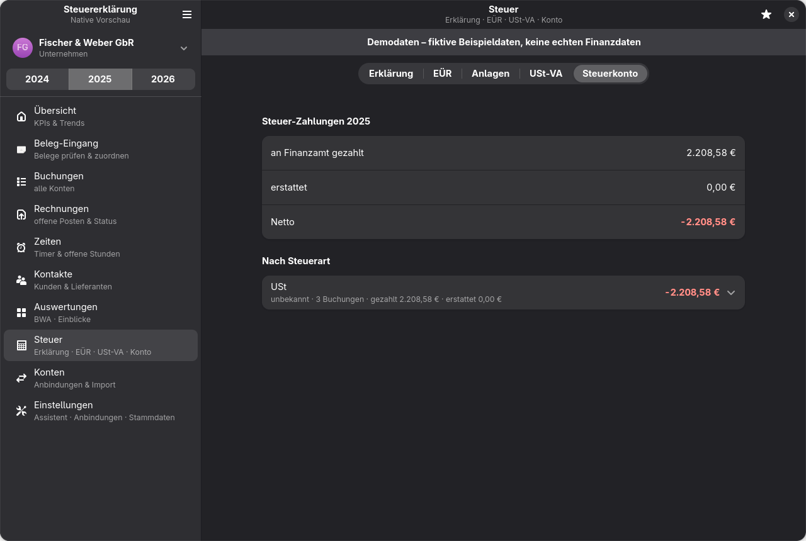

Das Gegenstück zu den Formularen: nicht was geschuldet wird, sondern was wirklich ans Finanzamt
gezahlt und von dort erstattet wurde, klassifiziert aus den importierten Buchungen und
aufgeschlüsselt **nach Steuerart**. Reine Store-Auswertung, kein ausgehender Aufruf.

## 13. Steuer (privat) — Einkommensteuer

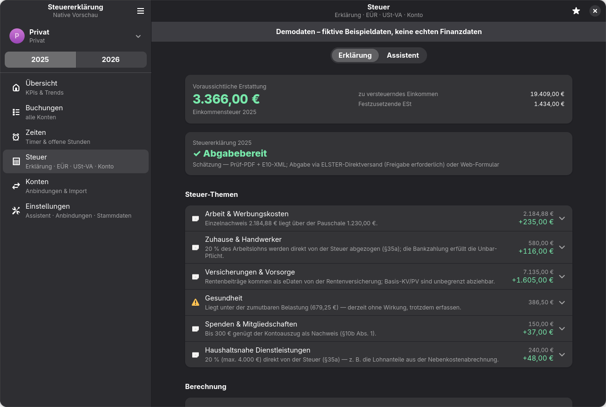

Bei einer `privat`-Entität wird aus dem Steuer-Hub die Einkommensteuer: voraussichtliche
Erstattung oder Nachzahlung, zu versteuerndes Einkommen, festzusetzende ESt — und darunter die
**Steuer-Themen** (Arbeit und Werbungskosten, Zuhause und Handwerker, Versicherungen und
Vorsorge, Gesundheit, Spenden, haushaltsnahe Dienstleistungen). Jedes Thema nennt den erfassten
Betrag, die Wirkung auf die Steuer und die Regel dahinter in einem Satz — inklusive der Fälle,
die *keine* Wirkung haben (hier: Gesundheitskosten unter der zumutbaren Belastung). Der Reiter
**Assistent** führt durch die Erfassung fehlender Angaben.

## 14. Konten — Anbindungen und Import

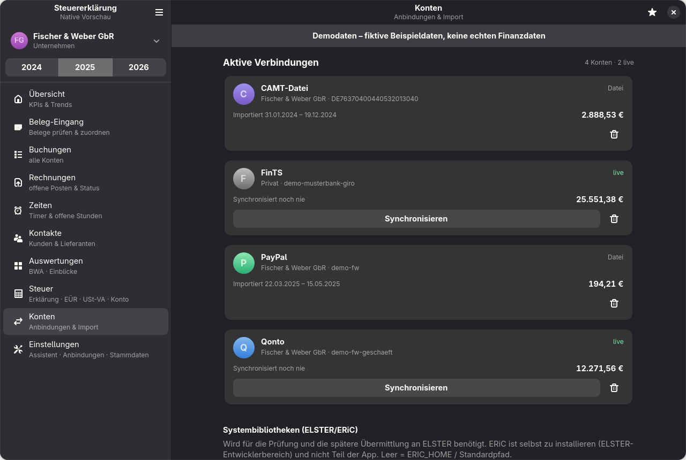

Alle verbundenen Konten über **alle** Entitäten (diese Ansicht ist global): Qonto, FinTS/Bank,
CAMT-Dateien, PayPal. Je Zeile Quelle, zugehörige Entität, abgedeckter Zeitraum, Saldo und ob es
eine **live**-Verbindung oder eine importierte **Datei** ist. Darunter die Systembibliotheken:
hier wird ERiC gesucht — leer bedeutet `ERIC_HOME` bzw. der Standardpfad.

## 15. Einstellungen — Stammdaten, Anbindungen, Assistent

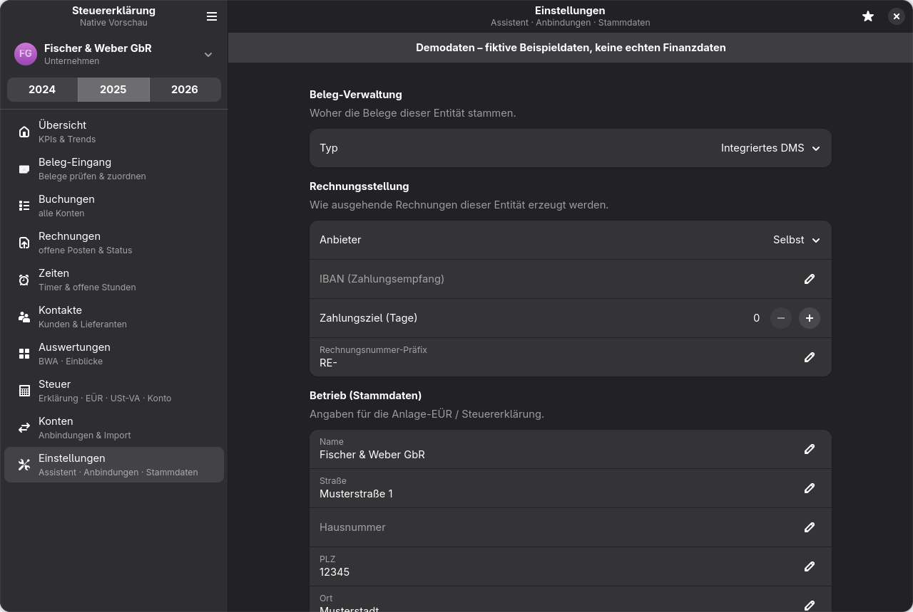

Die Ansicht, die tatsächlich schreibt: Beleg-Verwaltung (eingebautes DMS oder Paperless),
Rechnungsstellung (Anbieter, Zahlungsempfänger-IBAN, Zahlungsziel, Nummernpräfix) und die
**Betriebsstammdaten**, die in die Anlage EÜR gehen. Weiter unten der integrierte Assistent und
der MCP-Server: ob externe Assistenten sich verbinden dürfen, ob **schreibende** Werkzeuge über
die schreibgeschützte Voreinstellung hinaus geöffnet werden, und welche Werkzeuggruppen sichtbar
sind. Änderungen greifen beim nächsten Start des MCP-Servers. Die Gruppe **Abgleich** schaltet den
Hintergrund-Abgleich ein oder aus und setzt die Abstände.

Ganz oben stehen zwei Gruppen, die nicht im Manifest landen, sondern in der Einstellungsdatei des
Benutzers (`$XDG_CONFIG_HOME/eu.jumplink.Steuererklaerung/settings.json`):

- **Allgemein:** Wechsel zwischen Demo und eigenen Daten (nach Rückfrage startet die App neu — ein
  laufender Prozess wird nie auf den anderen Bestand umgebogen), „Einführung erneut anzeigen" und
  ob der KI-Assistent in der Kopfzeile erscheint.
- **Sicherung:** „Jetzt sichern", letzte Sicherung, Ordner und wie viele behalten werden. Was
  gesichert wird und wie man wiederherstellt: [backup.md](backup.md).

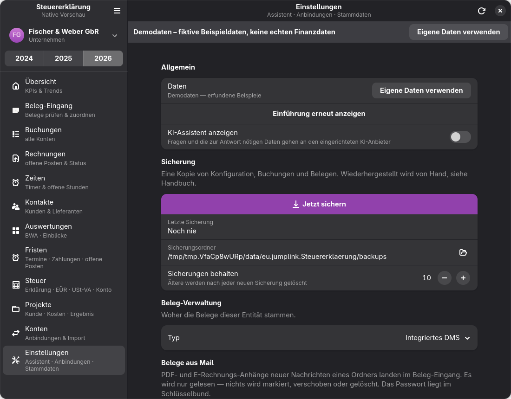

## Erster Start — die Einführung

Wer die App zum ersten Mal öffnet — **keine** Einstellungsdatei mit abgeschlossener Einführung und
**kein** Manifest (`steuererklaerung.json` oder das ältere `buchhaltung.json`) —, sieht eine kurze
Einführung: was die App tut und dass die Daten lokal bleiben, dass sie keine Steuerberatung ist,
dann die Wahl zwischen Demo, eigenen Daten (weiter zum Einrichtungsassistenten) und „Ich habe schon
eine steuererklaerung.json" (zeigt, wo die App sie sucht). Zuletzt die optionalen Anbindungen und
der KI-Assistent, standardmäßig aus. Bestehende Installationen haben ein Manifest und sehen die
Einführung deshalb nie. „Später" schließt sie, ohne etwas zu speichern; sie kommt beim nächsten
Start wieder. Erneut öffnen: Hauptmenü → „Einführung" oder Einstellungen → Allgemein.

| | |
|---|---|
| 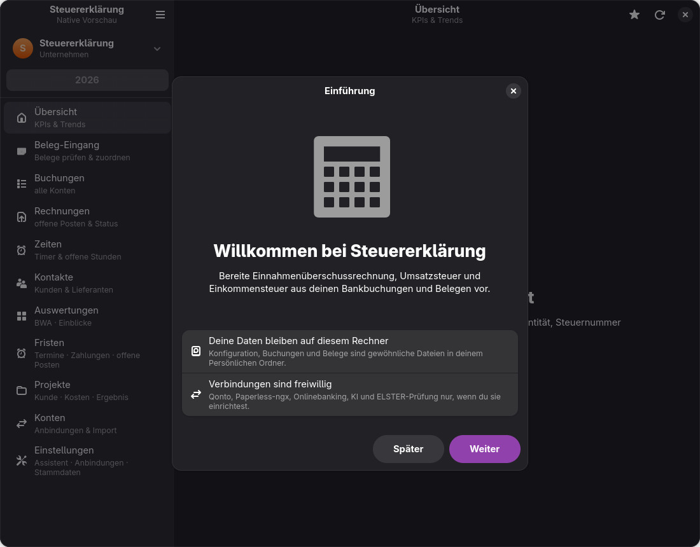 | 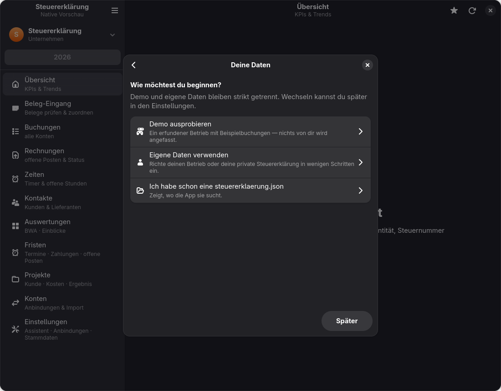 |

Englische Fassungen: `welcome-*-en.png`. Erzeugt von `app/dev/welcome-e2e.sh <ordner>`.

---

## Nicht abgebildet

- **Zeiten** (Timer und offene Stunden, Grundlage für „Rechnung aus erfassten Zeiten") — im
  Demo-Bestand leer, ein Bild davon zeigte nichts.
- **Steuer › USt-VA** — die Voranmeldung wird bislang ausschließlich aus Paperless-Dokumenten
  aggregiert (`app/src/core/elster/ustva-aggregate.ts`), nicht über den `DmsProvider`. Die
  Demo-Entität nutzt das eingebaute DMS, deshalb bleibt der Reiter dort leer. Mit einer
  Paperless-Entität funktioniert er; als Kommando ist es `steuer elster ustva report`.

## Die Bilder neu erzeugen

Die Aufnahmen entstehen ohne Fenstermanager-Werkzeuge: die App bringt über
[`@gjsify/devtools`](https://github.com/gjsify/gjsify) eine D-Bus-Steuerebene mit, deren
`Screenshot`-Methode das Fenster direkt aus GSK rendert.

1. Einmal bauen: `cd app && gjsify run build:app`.
2. App im Demo-Modus mit Steuerebene starten — die Ansicht kommt aus Umgebungsvariablen:

   ```bash
   cd app
   GJSIFY_DEVTOOLS=1 STEUER_DEMO=1 \
   STEUER_APP_ID=eu.jumplink.Steuererklaerung.Shots \
   STEUER_APP_VIEW=steuer STEUER_APP_TAB=euer \
   STEUER_APP_ENTITY=gbr STEUER_APP_YEAR=2025 \
   gjsify run start:app &
   ```

   `STEUER_APP_VIEW` sind die Nav-Ids (`home`, `review`, `transactions`, `rechnungen`, `zeiten`,
   `kontakte`, `auswertungen`, `steuer`, `konten`, `settings`), `STEUER_APP_TAB` die Reiter der
   Hubs (`eingang`/`offen`/`alle` bzw. `erklaerung`/`assistent`/`euer`/`anlagen`/`ustva`/`steuerkonto`).
   Eine eigene `STEUER_APP_ID` erlaubt es, parallel zur normalen Instanz zu laufen.
3. Warten, bis die Steuerebene antwortet — **nie eine feste Wartezeit**, sondern `GetStatus`
   pollen —, dann Fenstergröße setzen und auslösen:

   ```bash
   BUS=eu.jumplink.Steuererklaerung.Shots
   OBJ=/eu/jumplink/Steuererklaerung/Shots/devtools
   until gdbus call --session -d $BUS -o $OBJ -m org.gjsify.Devtools.GetStatus; do sleep 1; done
   gdbus call --session -d $BUS -o $OBJ -m org.gjsify.Devtools.ResizeWindow 1280 860
   gdbus call --session -d $BUS -o $OBJ -m org.gjsify.Devtools.Screenshot 'window'   # PNG-Bytes
   ```

   `gdbus` gibt die Bytes als GVariant-Text aus; praktischer ist ein kurzes GJS-Skript, das den
   Rückgabewert per `Gio.File` wegschreibt.

Zwei Fallen, beide gemessen: Das Assistenten-Panel öffnet sich, sobald das Fenster den
Breakpoint bei 1180 px überschreitet — also **erst** die Größe setzen, dann den Stern in der
Kopfzeile per `ActivateWidget` schließen, dann auslösen. Und `pkill -f steuer-app` trifft die
eigene Shell mit; zum Beenden `ActivateAction 'app' 'quit'` verwenden.
