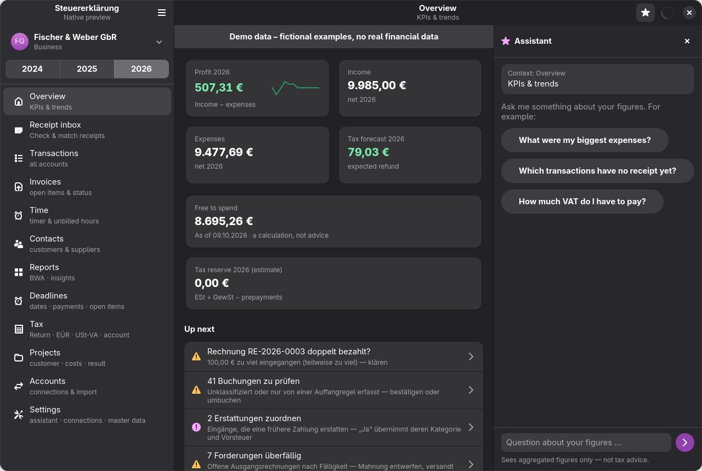
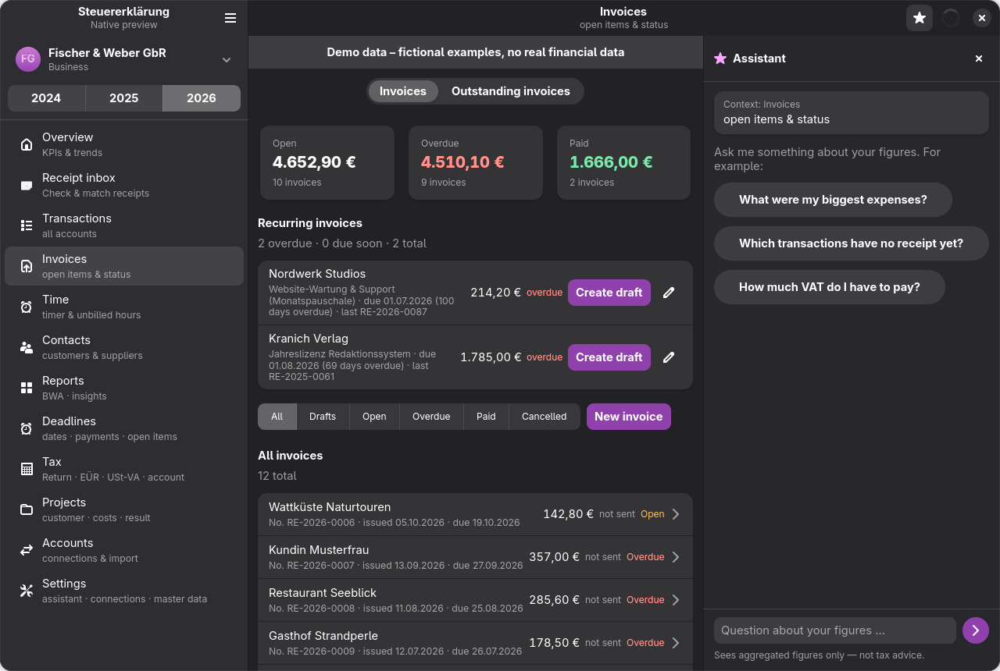
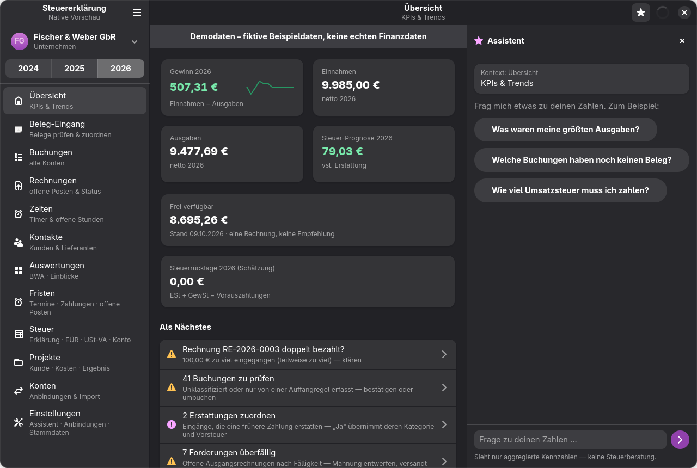

# Translation status (desktop UI)

The GNOME app is translatable with gettext. Source strings are English; German lives in
[`app/po/de.po`](../../app/po/de.po). A German-locale user sees the same German texts as before
the conversion. How to add or change a string: [CONTRIBUTING.md](../../CONTRIBUTING.md#translations).

## How the language is chosen

The app calls `setlocale(LC_ALL, "")`, so the usual order applies: `LANGUAGE`, then `LC_ALL`,
`LC_MESSAGES`, `LANG`. A `de_*` locale loads the German catalogue; any other locale shows the
English source strings. In development the catalogue comes from `app/dist/locale/`, which
`gjsify run build` compiles. The E2E scripts start the app with `LANG=de_DE.UTF-8` (override with
`E2E_LANG`), because they click by German labels.

`gjsify run check` includes `check:i18n`, which fails on a stale `.pot`, a missing, empty or fuzzy
German entry, or placeholders that differ between msgid and msgstr.

## What stays German

- **Core, CLI and MCP output.** Everything the core computes as text (tax logic, the CLI, the MCP
  tools) is unchanged and German.
- **Documents.** Tax forms, ELSTER XML, return PDFs and customer invoice PDFs are not translated.
- **Strings the core hands to the UI.** Some texts are built in core presenters and shown as is,
  so they stay German in the English UI for now: the "Up next" task titles and their subtitles on
  the Overview, Hinweise subtitles, the reasons and origin texts of review items (`GRUND_TEXT`,
  `herkunft`), the formula and hints of "Free to spend", payment-reminder levels and letter text,
  form validation messages and the refund-group descriptions.
- **Official tax terms**, also in the English UI (see the table below).

## Done

34 TypeScript files and 11 Blueprint files, 742 msgids (16 with plurals, 35 with a context).

| Area | Views |
|---|---|
| Shell | window, navigation, keyboard shortcuts, sync, toasts, entity switcher, glossary help, FinTS prompts, assistant panel |
| Overview | home (KPIs, Hinweise list), Hinweis actions |
| Transactions | transactions list, transaction detail, review queue ("To review"), mark as transfer, split, rule from selection |
| Receipts | receipt inbox, open receipts, documents, receipt upload, link receipt, receipt metadata, document rules |
| Invoices | invoice list, invoice detail, invoice form, send invoice, payment reminder |
| Settings | settings top level |
| Common | shared dialogs, entity dialogs, tab hub, view utilities |

The glossary ([`core/lib/glossary.ts`](../../app/src/core/lib/glossary.ts)) has an English
twin, `GLOSSARY_EN`, with the same keys; `check:glossary` enforces the parity.

Plural handling fixed a few German grammar slips along the way: "1 Belege" is now "1 Beleg",
"seit 1 Tagen" is "seit 1 Tag", and "Rechnung(en)", "Buchung(en)" and "Ausnahme(n)" now pick the
right form.

## Remaining

40 files, still with German literals (zeiten-view, herleitung-dialog and
konto-hinzufuegen-dialog are partly done):

- **Accounts and tax:** konten-view, konto-hinzufuegen-dialog, absenden-section,
  absenden-dialog, herleitung-dialog, steuer-view, ustva-view, steuererklaerung-view,
  steuer-assistent-view, steuerkonto-view, auswertungen-view
- **Settings subpages:** privat, klassifizierung, dms-invoicing, betrieb-ust, abschluss, kinder,
  gewerbe-aufgabe, belege-mail, mail-versand, mail-vorlagen
- **Invoices, adjacent:** wiederkehrend-dialog, forderungen-view, laufende-kosten-view,
  kontakte-view, kontakt-form-dialog, zeit-rechnung-dialog, mail-sender
- **Projects, time, deadlines:** projekt-detail-dialog, projekt-form-dialog,
  projekt-zuordnen-dialog, projekte-view, zeiten-view, zeit-projekt-dialog, fristen-view,
  frist-erledigen-dialog
- **Other:** anlagen-view, setup-assistant, erstattung-group

## Terminology

| German | English UI |
|---|---|
| Buchung | Transaction |
| Beleg / Beleg-Eingang | Receipt / Receipt inbox |
| Rechnung | Invoice |
| Übersicht | Overview |
| Auswertungen | Reports |
| Fristen | Deadlines |
| Abgleich (bank sync) / Abgleich (auto-matching) | Sync / Matching |
| Umbuchen / Umbuchung | Mark as transfer / Transfer |
| Frei verfügbar | Free to spend |
| Steuerrücklage | Tax reserve |
| Herleitung | Derivation |
| Festschreiben / Stornieren | Finalize / Cancel invoice |
| Mahnung | Payment reminder |
| Vorsteuer / USt | Input VAT / VAT |
| Kennzahl | Form line (Kz) |

Kept in German, glossed where the UI explains them: **EÜR** (cash-basis profit statement),
**USt-VA / Umsatzsteuer-Voranmeldung** (advance VAT return), **Gewerbesteuer** (trade tax),
**Kz** numbers (form line numbers), **Anlage EÜR** (EÜR form), **Steuernummer** (tax number),
**Finanzamt** (tax office).

## Screenshots

Demo data, English locale:

The same Overview under a German locale:

